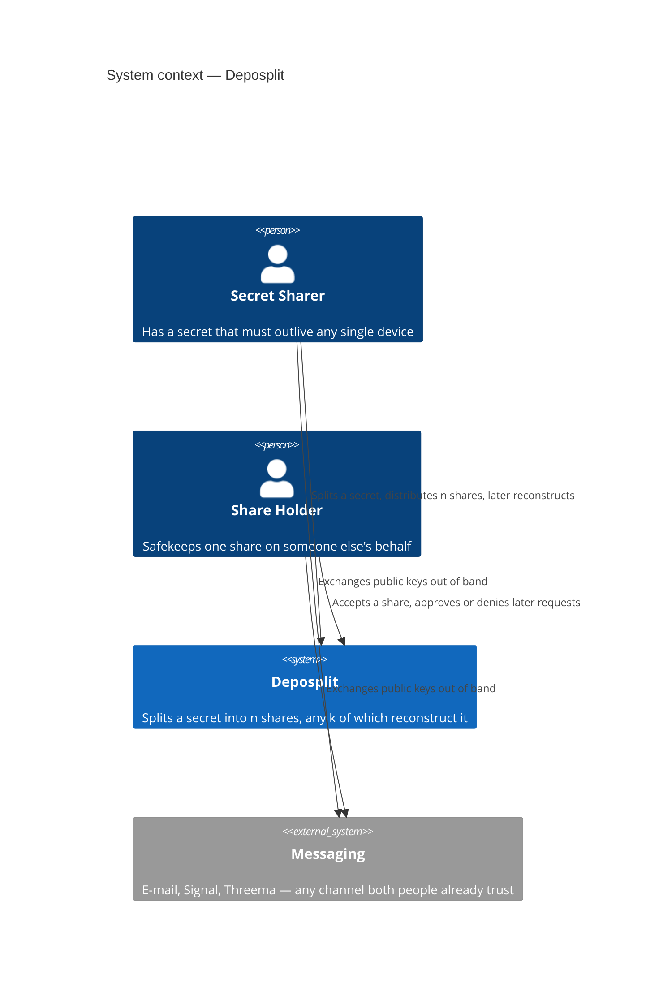
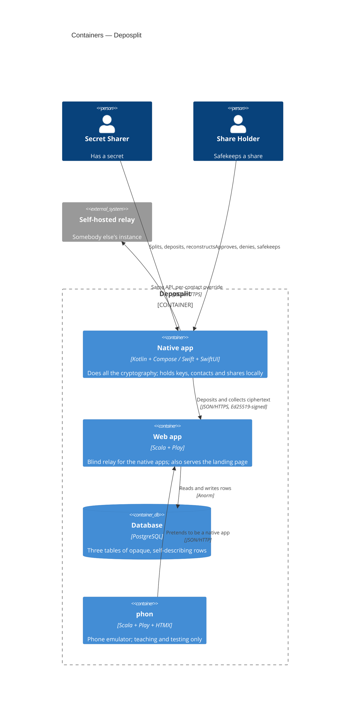
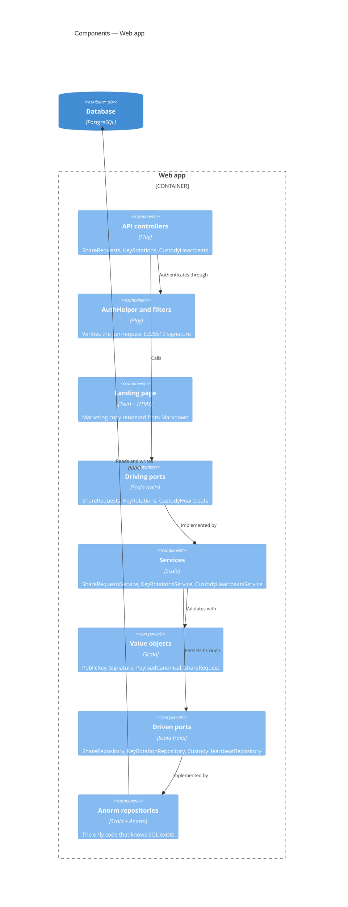
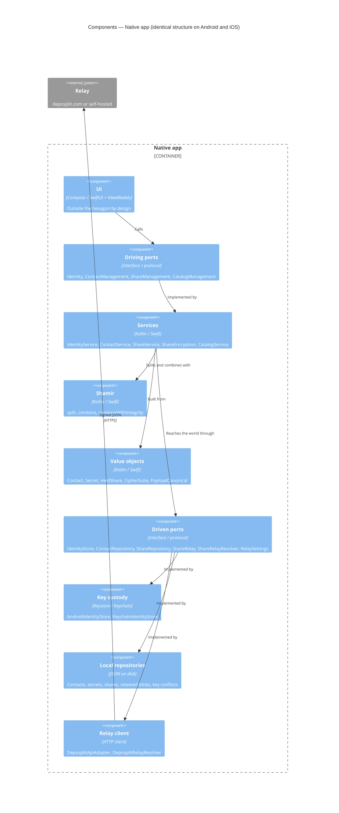

# Architecture

Deposplit splits a secret into *n* shares using Shamir's Secret Sharing, gives each share
to a person of your choosing, and reconstructs the secret when at least *k* of them
cooperate. Fewer than *k* shares reveal **nothing** — not "not much": below the threshold
the shares are information-theoretically independent of the secret.

This document covers the bones. Wire formats are in [protocol.md](protocol.md),
cryptographic constructions in [security.md](security.md), and the human trust rules in
[trust-model.md](trust-model.md).

## Architecture, and what is merely design

Per [What about architecture?](https://devwebapps.squeng.com/what-about-architecture.html):
design is deliberate choice-making under constraints, and **architecture is the subset of
those choices that is hard to reverse** — the bones, not the flesh. The working test is
*"if we got this wrong and wanted to change it in year three, how painful would that be?"*

That test is this file's admission criterion. Naming conventions, screen layouts and file
trees are design, and are documented where they are used. Three things are architecture:

- **The relay is cryptographically blind.** It stores and forwards opaque bytes and never
  participates in key agreement. Reversing this would mean redesigning every message.
- **The hexagon boundary is enforced by the build, not by convention.** Reversing this
  loses the guarantee immediately and silently.
- **Identity is a keypair, not an account.** No registration, no user table, no password.
  Reversing this means inventing everything a keypair currently replaces.

## System context

These are two *roles*, not two kinds of user. Everybody runs the same app, and the same
person is a Secret Sharer for their own secrets and a Share Holder for their friends'.

`Messaging` earns its place on the diagram because it is load-bearing. **Deposplit never
introduces two people to each other.** Public keys are exchanged out of band — ideally by
scanning a QR code in person — and the system has no directory, no invitation, no friend
request and no lookup. The boundary genuinely stops at "two people who already know each
other". That is also why there is so little to breach: the relay cannot enumerate its own
users.

## Containers

| Container | Technology | Responsibility |
|---|---|---|
| Native app | Kotlin/Compose, Swift/SwiftUI | Everything that matters: splitting, combining, encryption, signing, key custody, contacts, shares |
| Web app | Scala + Play 3, sbt | Store and forward opaque bytes; verify signatures; serve the landing page |
| Database | PostgreSQL (H2 in dev and test) | Three tables — no user table, no contact table |
| phon | Scala + Play + HTMX | A browser-based fake phone for demos and manual testing |

**The Web app is a relay, not a store.** It sees ciphertext it cannot decrypt, addressed
between public keys it cannot resolve to people. A full database breach yields opaque
blobs plus the knowledge that *some* key deposited *something* for *some other* key. To
reconstruct anything, an attacker must instead compromise *k* holders' devices or defeat
*k* holders' consent. This is the whole design, and the rest follows from it.

The relay is therefore a **mailbox, not a vault**: it may drop any row at any time.
Correctness never depends on retention — see "absence is never a signal" in
[protocol.md](protocol.md).

**Self-hosted relays (BYOR).** Any contact may carry a `relayBaseUrl` override, routing
that contact's traffic to their own instance instead of deposplit.com. There is no
federation and no relay-to-relay traffic — the client simply talks to whichever relay a
given contact names. Operations spanning several contacts fan out across every distinct
relay involved, each independently soft-failed so one unreachable host cannot blank out
the rest.

**phon is for teaching and testing only, and can be ignored.** It is a browser-based
emulator that mimics a native app against a live relay, useful for demonstrating the
protocol without three physical devices. It is not a product surface, holds no real keys,
and nothing in the shipping system depends on it. It lives in its own sbt subproject
precisely so it cannot accidentally become a dependency of anything else. If you are
reading this to understand Deposplit, skip it.

> phon is *intended* to be unreachable outside development: `PhonModule` is enabled only
> in `conf/localhost.conf`, and `PhonyPhonesFilter` is meant to reject its paths outside
> `Mode.Dev`. That filter currently guards `/phonyPhones` while `conf/routes` mounts the
> emulator at `/phonyPhone`, so it never matches. Tracked in [../TODO.md](../TODO.md).

## Components — Web app

The `relay` subproject holds the middle three components and has **no dependency on Play**.
Signature verification lives inside it, in `PublicKey`, because deciding whether a request
is authentic is a domain question rather than a transport one — which is also why the
relay verifies payload signatures server-side even though it cannot read what they protect.

## Components — Native app

Both apps share one hexagon design: same port names, same service names, same value
objects. That is deliberate — a decision made on one platform ports to the other by
inspection, and the cross-platform signature vectors described in
[security.md](security.md) prove the two agree byte-for-byte rather than merely in spirit.

## Ports and Adapters, enforced by the build

The domain defines *ports* — interfaces for everything it needs from the world — and
infrastructure supplies *adapters* implementing them. Driving ports are called by the
outside; driven ports are called by the domain. What makes this hold is that **the
boundary is a build-level fact rather than a code-review convention**:

| Repo | Mechanism | A violation is |
|---|---|---|
| `deposplit.com` | sbt subprojects `relay` and `phon`, neither depending on Play | a resolution failure |
| `Android` | Gradle module `:hexagon`, plain Kotlin/JVM, no AGP plugin | a compile error |
| `iOS` | Swift package `hexagon`, declaring no `UIKit`, `SwiftUI` or `Security` dependency | a compile error |

The root project depends on the hexagons; the hexagons never depend on the root. An
accidental framework `import` in domain code cannot compile, so the boundary cannot erode
quietly. That is what the build-file ceremony buys.

The UI layer sits **outside** the hexagon and uses MVVM/MVI as is conventional on each
platform. Compose and SwiftUI's reactive models do not map cleanly onto port/adapter
shapes, and forcing them would buy ceremony rather than protection. Navigation is likewise
left a platform concern.

Both hexagons and the Play app are written **synchronously** — no `Future`s, no reactive
plumbing. Stack traces stay readable, and with virtual threads mainstream the cost of
blocking I/O is negligible.

## Repository layout

Three independent repositories under the [Deposplit organisation](https://github.com/Deposplit),
cloned side by side into a `Deposplit/` workspace that is itself not a git repository.

| Folder | Repository | Contents |
|---|---|---|
| `deposplit.com/` | [deposplit.com](https://github.com/Deposplit/deposplit.com) | Relay, landing page, and the docs covering all three repos |
| `Android/` | [Android](https://github.com/Deposplit/Android) | `:hexagon` (domain) + `:app` (adapters and UI) |
| `iOS/` | [iOS](https://github.com/Deposplit/iOS) | `hexagon` Swift package + `Deposplit` app target |

Inside `deposplit.com/`, `hexagons/relay` and `hexagons/phon` are sibling sbt subprojects
with no dependency on one another; the root Play project depends on both.

## Roads not taken

Three alternatives were taken far enough to be worth recording, because each is the
obvious suggestion from anyone meeting the problem for the first time.

**Signal.** The project began by asking whether it could piggyback on Signal — its
contacts, its groups, its delivery. It cannot. Signal is deliberately an appliance rather
than a platform: no SDK, no inter-app API, no supported way for third-party software to
send or receive through it. Separately, `libsignal` is AGPL-3.0, and the Double Ratchet is
built for continuous conversations — it earns its keep across thousands of messages, not
across one deposit that may sit untouched for years.

**Matrix.** Adopted, built on, then abandoned. Matrix *is* designed to be built upon, and
the work reached a signed-in client. Three things sank it. It is heavyweight for a
four-message protocol — sliding sync, room state, and roughly 20 MB of SDK to move a few
hundred bytes. matrix.org's authentication service rejected Deposplit's Dynamic Client
Registration outright, so the flagship homeserver was hostile to a third-party client. And
federation, its headline feature, buys nothing here, because recipients must install
Deposplit anyway. Paying a distributed system's costs for none of its benefits is the
definition of the wrong tool.

**A stateful relay.** The first custom design had a `users` registry and a `contacts` table
with server-mediated invitations — four tables in all. It worked, and it quietly gave away
the whole game: the server knew who its users were and who knew whom. That social graph is
more sensitive than many of the secrets it would have been protecting, and holding it is
precisely what this product exists not to do. It collapsed into a registration-free relay
whose rows are self-describing and whose callers authenticate per request by signature.
Three tables now, none of them about people.

The rest, in brief:

| Alternative | Why not |
|---|---|
| XMPP + OMEMO | Matrix's problems, an older and more fragmented ecosystem, weaker mobile SDKs |
| Nostr | NIP-44 encryption less battle-tested; relay reliability varies widely |
| P2P (WebRTC, Bluetooth, DHT) | Shares must reach recipients offline for months; that needs storage |
| libsodium | A native `.so` plus JNA on Android and hand-porting on iOS, for primitives already in BouncyCastle and Swift Crypto |
| MongoDB | The data is relational and the consent state machine wants real transactions |
| A web app instead of native | Private keys in IndexedDB, which browsers clear; no OS keystore; XSS and extensions share the execution context |
| Per-secret relay routing | Wrong layer — a work/personal split is an identity boundary, not a property of a secret |
| Per-share commitments | A hash of a low-entropy secret's share is brute-forceable, so stolen commitments would reconstruct without consent |
| Web-of-trust / transitive vouching | Reintroduces the delegated trust that in-person key exchange exists to avoid |
| Cryptographic revocation | A stolen key signs a revocation as convincingly as its owner; revocation must be social |
| A self-custodied recovery key | It is another secret you must keep safe — the exact problem Deposplit exists to solve |
