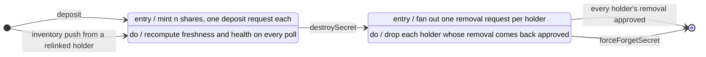
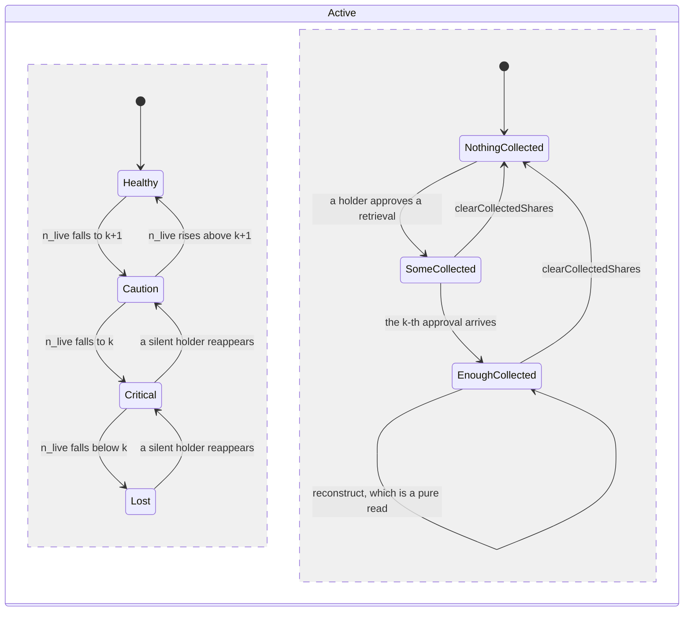
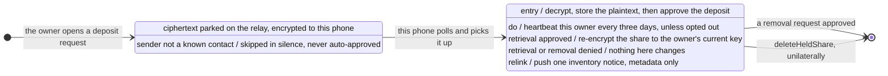
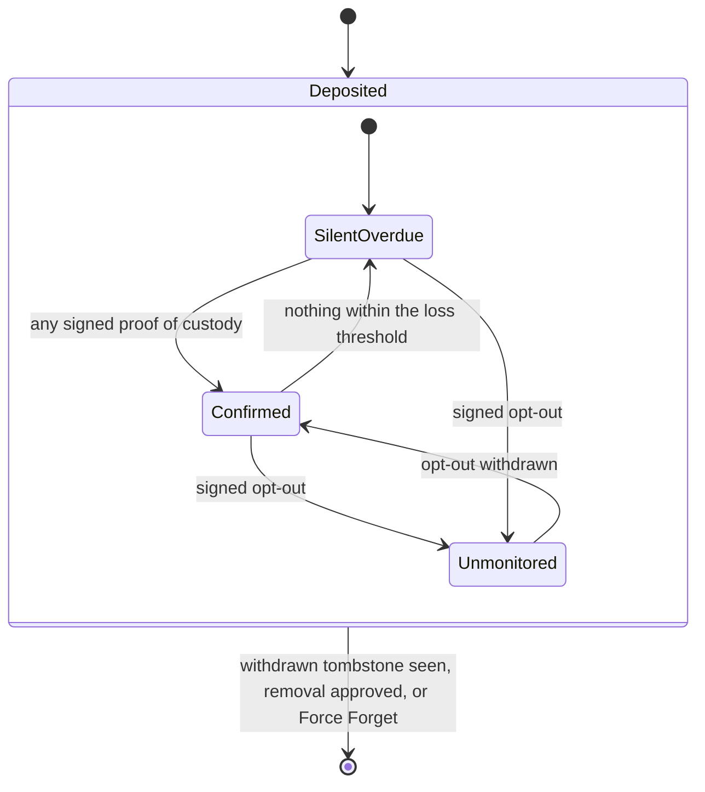

# Lifecycles

The other documents cut Deposplit by layer: the wire in [protocol.md](protocol.md), the
cryptography in [security.md](security.md), the human rules in
[trust-model.md](trust-model.md), the screens in [interaction.md](interaction.md). This one
cuts it by **time** — two long-lived things, each from the moment it comes into existence
to the moment nothing is left of it.

Nothing here is new. Every state and every transition below is already in the code and in
those documents; what this adds is the shape they make laid end to end.

## No lifecycle lives in one place

One share exists as three records on three machines, and no two of them are ever written
together:

| Record | Where | What it is |
|---|---|---|
| `Secret`, plus one `ShareMetadata` per holder | the owner's phone | what the owner believes about her own secret |
| a `share_requests` row | the relay | a message in flight, or the trace one left |
| `HeldShare` | the holder's phone | the share itself, plaintext |

There is no transaction across them, and no push channel either. Every transition below is
therefore driven by **a poll**: a device opens the app, reads what its relays have, and
reconciles. Two rules govern that reconciliation everywhere, and most of what looks odd in
these machines follows from them:

- **Absence is never a signal.** A row that is gone means *collected, or never sent* — never
  *done*, and never *lost*. Clients upsert; they never delete because something stopped
  being there.
- **Consent is asymmetric.** A sender may ask a holder to hand a share back or destroy it,
  and the holder may refuse. A holder needs nobody's permission to stop holding.

## A secret, on its owner's phone

### The spine

| Transition | What runs | What the owner sees |
|---|---|---|
| → `Active`, by deposit | splits the secret, encrypts one share per holder, opens *n* deposit requests, saves *n* `ShareMetadata` rows and *n* retained blobs, then saves the `Secret` | a new entry in Split & shared |
| → `Active`, by recovery | `processRecoveryMetadata` rebuilds the record from a relinked holder's signed inventory notice — metadata only, never a share | the secret reappears, with the holders who have reported in so far |
| `Active` → `Destroying` | `destroySecret` writes the state **first**, then fans out one removal request per holder | the badge reads *Destroying*; Retrieve goes quiet; Force Forget appears |
| `Destroying` → gone | `reconcileDestroying` drops each holder's `ShareMetadata` as their removal comes back approved, and removes the `Secret` once none are left | it leaves the list |
| `Destroying` → gone, forced | `forceForgetSecret` removes the same records locally, without waiting | it leaves the list; the shares stay exactly where they are |

**Two states, and no `Destroyed` tombstone.** The second state exists because there is a
phase where the *decision* outlives the *fact*: Alice has decided, and the holders have not
all answered yet. Once they have, there is nothing left to remember, so the record is
removed outright rather than kept as a headstone. That is safe here, and only here, because
this is *local* absence — a record this device deleted on purpose — not a relay row that
might merely have been collected.

**A destruction is only ever visible as an answer.** Approving a removal makes the relay
sweep the rest of that holder's rows for this secret — the deposit above all, which may still
be holding ciphertext for a share that no longer exists — and keep the answered removal row
itself, signed by the holder. That row is the whole of the evidence, and it has to be: every
other trace of that holder's custody has just been deleted, and a row that is merely gone
means *collected, or never sent*. So the owner reads the answer, checks the signature on it
the same way she checks a retrieval approval, drops that holder, and only then deletes the
row she has finished with.

**The state flips before anybody answers.** `destroySecret` saves `Destroying` and fans the
removals out afterwards, so a secret can never look active while its removals are already
travelling, and a fan-out that partly fails changes nothing about the decision. The free
tier counts *active* secrets, which means the slot is released at the moment of the flip
rather than at the end of the teardown.

**Two entrances, and one of them is recovery.** A phone that has lost everything gets its
records back from the holders themselves: each relinked holder pushes one `inventory` notice
per share they hold, and the secret is recreated `Active` from what they report. This is
also why *forgetting* is never quite final — see the last table in this document.

**A repair is not on this machine.** Restoring redundancy means reconstruct, then re-split,
and the re-split mints a **fresh `secretId`** and therefore a fresh polynomial: a new
lifecycle beside the old one, not a transition within it. The old secret is destroyed
afterwards, by hand, and until it is, both are `Active`. Shares from two polynomials for the
same value are not interchangeable, which is exactly why this cannot be modelled as the same
secret carrying on.

### Inside `Active`: two clocks, neither of them stored

While a secret is active, two things change continuously without the state changing at all.
In UML terms they are orthogonal regions; in the code they are derived — recomputed from
local records on every read, stored nowhere. One tracks **redundancy**, the other the
**retrieval round**.

**The redundancy region counts live holders, not rows.** `n_live` is the freshness-gated
count: a holder who has gone silent past the loss threshold drops out of it, reversibly, and
a holder who opted out of monitoring never counted and never alarms. The alarm fires at
`n_live == k` rather than below it, because *k* is the last moment at which a repair is
still possible. The ladder and its tuning are in
[trust-model.md](trust-model.md#secret-health-and-repair). While a secret is `Destroying`
this whole region is suppressed: a falling holder count is the goal there, not a problem.

**The retrieval region is where the three buttons come from.** Retrieve stays available all
the way through — even once *k* copies are in — because the surplus is what the integrity
cross-check is made of, and it goes quiet only when no holder is left to ask.

**Reconstruct is a self-transition**, and that is the load-bearing part: it collects,
decrypts, combines and returns, and leaves everything exactly as it found it. Nothing
records that a secret was read. The collected copies outlive the reading, each still
carrying its ciphertext on the relay, which is why **clearing is a separate act and the only
way back** — and why nothing on the screen may claim to know whether the reader has seen
their secret. It knows only whether the secret is in front of them right now.

Clearing takes the asks nobody has answered yet along with the copies, so that afterwards
there is no retrieval flow for this secret at all. That is also what makes a *second* round
possible: an approved request counts as live, so without the sweep every future ask would be
skipped as already outstanding.

### What moves the holders without moving the secret

- **A holder withdraws.** Their `ShareMetadata` is dropped on the next poll, `n_live` falls,
  and the health badge may drop a rung. The secret stays `Active`: erosion is a health
  event, never a state change.
- **A holder goes quiet.** They fall out of `n_live` at the loss threshold and come back the
  moment they reopen their app. Nothing is written down and nothing is lost.
- **Somebody rotates their keys.** `ShareMetadata` references a local `contactId`, not a
  public key, so a rotation or a recovery re-points the contact record and leaves every
  share pointer intact.

## A share, on its holder's phone

**The record has no state field.** `HeldShare` exists, or it does not; unlike `Secret`, there
is no column to read. The phases above are phases of the *share*, not of a row: `InTransit`
is a relay row plus the owner's retained blob, `Held` is a `HeldShare`, and the end is the
absence of one. Nothing needs remembering after deletion, because a custodian who has
stopped holding has nothing left to say about it.

**There is no failure exit before `Held`**, and that absence is honest: a share that never
arrives leaves no trace whatsoever on this phone, because this phone never knew. The whole
record of the attempt lives on the owner's side, where the holder simply never confirms and
never counts toward `n_live`.

**Nobody is asked whether to accept a deposit.** Deposits never appear in the Requests tab:
a pending one from a **known** contact whose signature verifies is picked up automatically,
and one from anybody else is left pending and skipped in silence — never denied, and never
stored. The owner sees the second case as a holder who simply never confirms.

**The approval is an acknowledgement, not the delivery.** The pending row already carries
the ciphertext — the sender's signature covers it, so the row cannot be verified without it
— so the order is decrypt, store, *then* approve. A failure anywhere leaves the row pending
with the relay's copy intact and the next poll simply retries; the approval's job is to tell
the owner the share arrived and let the relay drop its only copy. See
[protocol.md](protocol.md#absence-is-never-a-signal).

**The bytes never change while held.** A retrieval hands back a *fresh encryption* of the
same plaintext, to whatever key the owner has **now** — looked up live, not pinned at
deposit time. That is the point of decrypting at pickup, and it is what lets a secret
survive its owner rotating keys or recovering onto a new phone; see
[security.md](security.md#the-holder-decrypts-at-pickup).

**Two ways out, and only one of them needs anyone's permission.** A removal is a *request*:
it can be denied, and a denial ends nothing. `deleteHeldShare` is unilateral and needs
nobody — it leaves a withdrawn tombstone behind as a courtesy, best-effort, and deletes
locally whether or not that reaches anybody. Nothing can compel a holder to destroy a share,
and nothing can stop one.

### The same share, from the owner's side

The mirror record is `ShareMetadata`, and what changes on it is not custody but **belief**:

There is deliberately no *awaiting pickup* bucket: a holder who has confirmed nothing yet is
simply silent, and does not count. Any signed proof of custody refreshes the clock — the
observed pickup, a retrieval approval, or a heartbeat naming that `secretId` — so a holder
you recently retrieved from is fresh for free. `Confirmed` carries a *getting stale*
sub-flag as it nears the edge, so the nudge arrives before the holder drops out rather than
after. The thresholds are in [trust-model.md](trust-model.md#freshness).

## Where the two machines disagree

They are coupled only by messages and by silence, so they are routinely out of step. Every
row below is a designed-for gap, not a defect:

| The owner believes | The holder's phone holds | What closes the gap |
|---|---|---|
| a holder has gone silent | nothing — the phone was lost, and its replacement has no record it ever held anything | only the owner can notice; `n_live` drops at the loss threshold, and repair is reconstruct-then-re-split |
| a holder has gone silent | the share, on a phone nobody has opened for a fortnight | the next app open, which restores them to `n_live` in full — which is what makes erring toward alarm cheap |
| the share is still out there | deleted, unilaterally | the withdrawn tombstone, observed on the next poll. Never the row's disappearance |
| the secret is `Destroying`, waiting on one holder | the share, with the removal denied | nothing. Force Forget is the owner's escape, and it deliberately does not reach the phone that holds the share |
| nothing — the secret was force-forgotten | a share nobody will ever ask about again | the holder may delete it at will; or, if they relink, their inventory push brings the owner's record back as `Active` |
| a holder has never picked up | nothing at all | the retained blob, which is why an uncollected deposit is not yet a lost share |
